# **τaos** ☯ **‪ي‬n 79**<!-- omit in toc -->
# Dashboard Guide<!-- omit in toc -->

This document serves to provide details on the data displayed at the [τaos dashboard](https://taos.simulate.trading).

- [Validator Page](#validator-page)
  - [Validator Info](#validator-info)
  - [Scoring Config](#scoring-config)
  - [Simulation Config](#simulation-config)
  - [Fee Policy](#fee-policy)
    - [Fee Parameters](#fee-parameters)
    - [Maker-Taker Ratio Chart](#maker-taker-ratio-chart)
  - [Trade Data](#trade-data)
    - [Trade Price Plot](#trade-price-plot)
    - [Trade Quantity Plot](#trade-quantity-plot)
    - [Trades Table](#trades-table)
  - [Books Table](#books-table)
  - [Agents Table](#agents-table)
  - [Incentives Plot](#incentives-plot)
- [Book Page](#book-page)
  - [Book Info](#book-info)
  - [Trade Data](#trade-data-1)
    - [Trade Price Plot](#trade-price-plot-1)
    - [Trade Quantity Plot](#trade-quantity-plot-1)
    - [Trades Table](#trades-table-1)
  - [Orderbook Data](#orderbook-data)
    - [Best Levels Plot](#best-levels-plot)
    - [Depth Plots](#depth-plots)
  - [Agents Table](#agents-table-1)
  - [Dynamic Fee Rates Plot](#dynamic-fee-rates-plot)
- [Agent Page](#agent-page)
  - [Agent Info](#agent-info)
  - [Trades Table](#trades-table-2)
  - [Score Plot](#score-plot)
  - [Performance Plot](#performance-plot)
  - [Requests Plot](#requests-plot)
  - [GenTRX Plots](#gentrx-plots)
  - [Daily Volume Plot](#daily-volume-plot)
  - [Round-Trip Volume Plot](#round-trip-volume-plot)
  - [Realized PnL Plot](#realized-pnl-plot)
  - [Kappa3 Plots](#kappa3-plots)
  - [Unrealized Profit \& Loss Plots](#unrealized-profit--loss-plots)
  - [Last Fee Rate](#last-fee-rate)
  - [Balances Plots](#balances-plots)
- [GenTRX Page](#gentrx-page)
  - [Status](#status)
  - [Miners](#miners)
  - [Training Progress](#training-progress)
  - [Per-Miner Performance](#per-miner-performance)
  - [Diagnostics](#diagnostics)

## Validator Page
The main page at which visitors to the dashboard land is the Validators page.  This page displays overview data for the simulation hosted by each sn79 validator.

### Validator Info

The top part of the dashboard page displays basic details of the selected validator.

The first row just indicates the UID, hotkey address and current simulation time.

The second row contains metagraph data for the validator - stake, vTrust, last update, emission and dividends.  See the [bittensor documentation](https://docs.learnbittensor.org/subnets/metagraph) for details on the meaning of these variables.

The third row displays the current resource usage of the validator hosting instance.

### Scoring Config

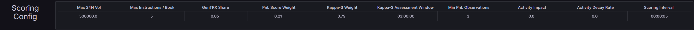

The first config table displays the parameters that govern how miners are scored.  See the [scoring documentation](https://simulate.trading/taos-im-scoring-paper) for full detail on the underlying formulas.

- **Max 24H Vol** - Cap on rolling 24-hour traded volume used by activity calculation; volumes above this don't earn additional activity.

- **Max Instructions / Book** - Maximum number of order instructions an agent may submit per book per scoring step; submissions above the cap are rejected.

- **GenTRX Share** - Fraction of overall scoring weight allocated to GenTRX (the training side of incentive).  The remainder is the trading-side weight.  Same value surfaced as **Pool Share** on the [GenTRX Page](#gentrx-page).

- **PnL Score Weight** - Relative weight of the PnL Score component inside the trading-side Trading Score.

- **Kappa3 Weight** - Relative weight of the Kappa3 Score component inside the trading-side Trading Score.  PnL Score Weight + Kappa3 Weight = 1 on the trading side.

- **Kappa3 Assessment Window** - Length of the rolling window (in simulation time) over which Kappa3 is computed.

- **Min PnL Observations** - Minimum number of realized PnL observations required for an agent to be eligible for a PnL Score; under this count the agent's PnL Score is suppressed.

- **Activity Impact** - Strength with which the activity factor scales the Kappa3 Score (higher = more reward concentrated on high-volume traders).

- **Activity Decay Rate** - Exponential decay applied to the activity factor when an agent's rolling round-trip volume falls below the target; controls how quickly inactivity is penalised.

- **Scoring Interval** - How often (in simulation time) the validator runs a full scoring + weight-update cycle.

### Simulation Config

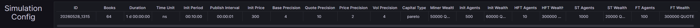

The second config table covers the simulation setup.

- **ID** - Unique identifier for the current simulation run (e.g. `20260523_1644`).

- **Books** - Number of order books in the simulation.

- **Duration** - Total simulation runtime in simulation time.

- **Time Unit** - Smallest time increment in the simulation.

- **Init Period** - Initial warm-up/stabilization period before miner agents are able to participate.

- **Publish Interval** - Frequency at which state updates are published to miners.

- **Init Price** - Starting price for assets at beginning of simulation.

- **Base Precision** - Decimal places for BASE quantities.

- **Quote Precision** - Decimal places for QUOTE quantities.

- **Price Precision** - Decimal places for price values.

- **Vol Precision** - Decimal places for volumes.

- **Capital Type** - Distribution method for initial capital allocation.

- **Miner Wealth** - Initial total value of assets allocated to each miner agent.

- **Init Agents** - Number of initialization agents present in the simulation.

- **Init Wealth** - Initial wealth allocated to each initialization agent.

- **HFT Agents** - Number of high-frequency trading agents.

- **HFT Wealth** - Total initial capital allocated to each HFT agent.

- **ST Agents** - Number of stylized trading agents.

- **ST Wealth** - Total initial capital allocated to each stylized trading agent.

- **FT Agents** - Number of fundamental trading agents.

- **FT Wealth** - Total initial capital allocated to each fundamental trader.

### Fee Policy

The next section displays configuration parameters for the fees applied in the simulation, as well as a visualization of the central parameter determining the fees in the [Dynamic Incentive Structure (DIS)](https://simulate.trading/taos-im-dis-paper) fee mechanism.

#### Fee Parameters

- **Policy** - Fee structure model being applied (e.g., DIS - Dynamic Incentive Structure).

- **Target MTR** - Target maker-to-taker ratio, the desired proportion of maker trades to taker trades executed by miner agents.

- **Trade Window** - Time window (in seconds or time units) used for calculating MTR.

- **Base Maker Rate** - Baseline fee rate charged on maker trades.

- **Base Taker Rate** - Baseline fee rate charged on taker trades.

- **Max Rebate** - Maximum rebate percentage.

- **Max Fee** - Maximum fee percentage.

- **Fee Shape** - Parameter controlling the evolution of fee values.

- **Rebate Shape** - Parameter controlling the evolution of rebate values.

#### Maker-Taker Ratio Chart 

This provides a visual representation of the maker-to-taker ratio over time across all the simulated books.  The fees applicable to trades are dependent on the MTR: divergences from the target towards higher maker ratio incur fees on makers during trades while takers receive a rebate, and if there is a higher proportion of trades where miner agents are the taker then makers will receive rebate while takers pay a fee.

### Trade Data

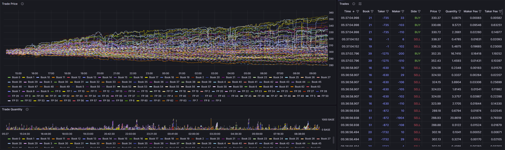

The next row contains information and visualizations related to trading activity throughout the simulation.  

#### Trade Price Plot
The Trade Price plot displays the history of last traded prices for all books, along with the fundamental price value for each.  The fundamental value is an internal variable associated with each book which contributes to the evolution of the price series.

#### Trade Quantity Plot
The Trade Quantity plot illustrates the total quantity traded in the last interval at the time the trade price was published.

#### Trades Table
The Trades table shows details of the latest 25 trades on each book:

- **Time** - Simulation timestamp of when the trade was executed.

- **Book** - Order book identifier where the trade occurred.  Note that clicking on the book ID here will redirect to the Book details page for that orderbook.

- **Taker** - Agent ID of the taker (the agent whose order removed liquidity).  Note that clicking on the agent ID here will redirect to the Agent details page for that UID.

- **Maker** - Agent ID of the maker (the agent whose order provided liquidity).  Note that clicking on the agent ID here will redirect to the Agent details page for that UID.

- **Side** - Direction of the taker's order (BUY or SELL).

- **Price** - Execution price at which the trade occurred.

- **Quantity** - Amount of base asset traded in the transaction.

- **Maker Fee** - Fee charged to or rebate earned by the maker agent (negative value indicates rebate).

- **Taker Fee** - Fee charged to or rebate earned by the taker agent (negative value indicates rebate).

### Books Table

The Books table displays the current state of the top 5 levels of each orderbook:

- **id** - Unique identifier for the order book.  Note that clicking on the book ID here will redirect to the Book details page for that orderbook.

- **bid_5, bid_4, bid_3, bid_2, bid_1** - Price levels for the top 5 bids (buy orders), with bid_1 being the best (highest) bid.

- **qty** - Quantity available at each corresponding bid price level.

- **ask_1, ask_2, ask_3, ask_4, ask_5** - Price levels for the top 5 asks (sell orders), with ask_1 being the best (lowest) ask.

- **qty** - Quantity available at each corresponding ask price level.

### Agents Table

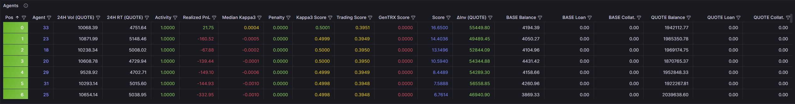

The Agents table provides summary performance information for all miners in the subnet.  Values are all aggregated over all books.

- **Pos** - Ranking position of the agent based on final score.  Sorted ascending by default.

- **Agent** - Unique identifier for the agent (equal to miner UID).  Clicking on the agent ID redirects to the Agent details page for that UID.

- **24H Vol** - The agent's total trading volume in QUOTE asset over the last 24 simulation hours for whichever book they traded in the least.

- **24H RT (QUOTE)** - The agent's total round-tripped volume in QUOTE asset over the last 24 simulation hours for whichever book they traded in the least.

- **Activity** - Activity score based on round-tripped trading volume executed in the latest assessment window.

- **Realized PnL** - Realized Profit and Loss from closed positions over the latest assessment window in QUOTE asset.

- **Median Kappa3** - Median of Kappa3 ratio values over all books.

- **Penalty** - Outlier penalty factor applied to the agent's Kappa3 Score due to inconsistent realized performance in one or more books.

- **Kappa3 Score** - Activity-weighted median normalized realized Kappa3 ratio with outlier penalty applied, for the latest assessment window.

- **Trading Score** - Combined trading-side score blending the Kappa3 Score with the PnL Score for the latest assessment window.  This is the trading half of incentive; the GenTRX half is below.

- **GenTRX Score** - The miner's EMA-smoothed GenTRX training reward, mirrored from the [GenTRX Page](#gentrx-page).  The final Score blends this with the Trading Score by the configured GenTRX Pool Share.

- **Score** - Final composite score determining agent ranking; an exponential moving average of the blended trading and GenTRX components.

- **ΔInv (QUOTE)** - Total change in miner inventory value since the start of simulation.

- **Base Balance** - Current balance of BASE held by the agent.

- **BASE Loan** - Quantity of BASE borrowed by the agent via leveraged orders.

- **BASE Collat.** - Collateral posted in BASE for borrowing.

- **Quote Balance** - Current balance of QUOTE held by the agent.

- **QUOTE Loan** - Quantity of QUOTE borrowed by the agent via leveraged orders.

- **QUOTE Collat.** - Collateral posted in QUOTE for borrowing.

### Incentives Plot

The incentives plot displays a history of the incentive value (as read from the metagraph) per UID.

## Book Page
This page displays overview data for a particular simulated book.  It is most easily accessed by clicking the links in either the Trades or Books table at the Validators page.

### Book Info

The first two rows display basic information about the selected book.

The unique identifier for the book and the current simulation time are presented in the first row.

The second row shows the latest traded price, the volume traded in latest interval, and the current best bid and ask price levels along with the quantity of open orders present and the best levels.

### Trade Data

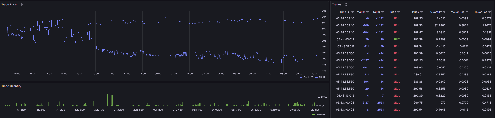

The next row contains information and visualizations related to trading activity in the selected book.

#### Trade Price Plot
The Trade Price plot displays the history of last traded prices for the selected book, along with the fundamental price value.

#### Trade Quantity Plot
The Trade Quantity plot illustrates the total quantity traded in the last interval at the time the trade price was published.

#### Trades Table
The Trades table shows details of the latest 25 trades on each book:

- **Time** - Simulation timestamp of when the trade was executed.

- **Taker** - Agent ID of the taker (the agent whose order removed liquidity).  Note that clicking on the agent ID here will redirect to the Agent details page for that UID.

- **Maker** - Agent ID of the maker (the agent whose order provided liquidity).  Note that clicking on the agent ID here will redirect to the Agent details page for that UID.

- **Side** - Direction of the taker's order (BUY or SELL).

- **Price** - Execution price at which the trade occurred.

- **Quantity** - Amount of base asset traded in the transaction.

- **Maker Fee** - Fee charged to or rebate earned by the maker agent (negative value indicates rebate).

- **Taker Fee** - Fee charged to or rebate earned by the taker agent (negative value indicates rebate).

### Orderbook Data

The next row contains visualizations of the orderbook state.

#### Best Levels Plot

This plot displays the prices of the first 5 levels of the book over time.  This allows to inspect the spread size and available liquidity over time.

#### Depth Plots

These plots illustrate the cumulative quantity of orders open among the top 21 levels on each side of the book.  Each dot represents a book level at price indicated on the x-axis, with the y-axis showing how much volume exists up to that level.

### Agents Table

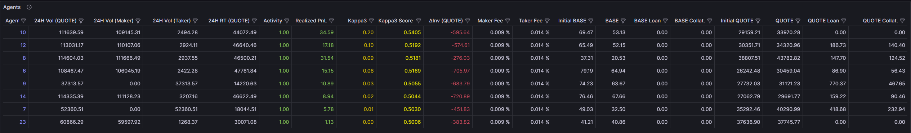

The Agents table at the Book page displays statistics for agents calculated specifically on the selected book:

- **Agent** - Unique identifier for the agent.

- **24H Vol (QUOTE)** - Agent's total trading volume in QUOTE asset over the last 24 simulation hours on the selected book.

- **24H Vol (Maker)** - Agent's maker trading volume (liquidity-providing trades) in QUOTE asset over the last 24 simulation hours on the selected book.

- **24H Vol (Taker)** - Agent's taker trading volume (liquidity-taking trades) in QUOTE asset over the last 24 simulation hours on the selected book.

- **24H RT (QUOTE)** - The agent's total round-tripped volume in QUOTE asset over the last 24 simulation hours for the selected book.

- **Activity** - Activity factor indicating agent's trading engagement level as a function of round-tripped volume.  This is multiplied onto the Kappa3 score for each book to reward miners who achieve high risk-adjusted performance while also trading significant volume.

- **Realized PnL** - Realized Profit and Loss from closed positions over the latest assessment window in QUOTE asset for the selected book.

- **Kappa3** - Kappa3 ratio for the selected book.

- **Kappa3 Score** - Kappa3-based score calculated as activity-weighted and normalized Kappa3 ratio for latest assessment period on the selected book.

- **ΔInv (QUOTE)** - Total change in miner inventory value since the start of simulation or registration of the UID (whichever is more recent).

- **Maker Fee** - Current maker fee rate at the time of observation for the agent on the selected book.

- **Taker Fee** - Current taker fee rate at the time of observation for the agent on the selected book.

- **Initial BASE** - Starting balance of BASE asset for this book at simulation start or registration.

- **BASE** - Current balance of BASE asset held by the agent on this book.

- **BASE Loan** - Amount of BASE asset borrowed by the agent on this book.

- **BASE Collat.** - Collateral posted in BASE asset for borrowing on this book.

- **Initial QUOTE** - Starting balance of QUOTE asset for this book at simulation start or registration.

- **QUOTE** - Current balance of QUOTE asset held by the agent on this book.

- **QUOTE Loan** - Amount of QUOTE asset borrowed by the agent on this book.

- **QUOTE Collat.** - Collateral posted in QUOTE asset for borrowing on this book.

### Dynamic Fee Rates Plot

This plot displays a history of the maker and taker fee rates applicable to miner agents in this book on the right y-axis, and the MTR for this book on the left y-axis.

## Agent Page

This page displays detailed statistics for a particular agent over all books for either a specific validator or all validators in the subnet. It is most easily accessed by clicking the links in either the Trades or Agents table at the Validators page.

### Agent Info

The first two rows display basic information about the selected agent.

The unique identifier for the agent and the current simulation time are presented in the first row.

The second row shows the key metagraph statistics for the agent - consensus, emission, incentive and trust.

### Trades Table

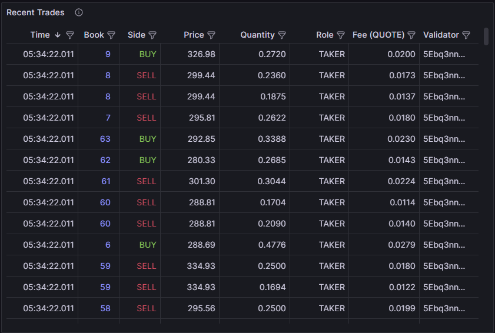

The Trades table sits to the right of the agent info at the top of the page and shows details of the latest 5 trades on each book for the selected agent:

- **Time** - Simulation timestamp of when the trade was executed.

- **Book** - Order book identifier where the trade occurred.  Note that clicking on the book ID here will redirect to the Book details page for that orderbook.

- **Side** - Direction of the taker's order (BUY or SELL).

- **Price** - Execution price at which the trade occurred.

- **Quantity** - Amount of base asset traded in the transaction.

- **Role** - The role of the selected agent in the trade, either maker (providing liquidity with passive order) or taker (taking liquidity with aggressive order).

- **Fee (QUOTE)** - Fee charged to or rebate earned in the trade by the selected agent.

- **Validator** - Hotkey of the validator in whose simulation the trade took place.

### Score Plot

The topmost left plot displays the total score for the agent as assigned by the selected validator(s) on the right y-axis, and the incentive of the agent on the left y-axis.

### Performance Plot

The Performance plot illustrates the ranking in terms of score of the agent over time as assigned by the selected validator(s), as well as an average ranking taken over all selected validators.  The ranking indicates where among the subnet miners this agent places; higher ranking indicates outperformance of others.

### Requests Plot

This plot illustrates statistics related to communication with validators; the left hand y-axis shows the average response time of the miner via the dotted blue line, while the right y-axis indicates counts of requests completed with different status:

- **Requests** - Total count of requests received in the observation window.
- **Success** - Responses successfully received by validators from the selected miner.
- **Failures** - Responses which failed to be received by the validator due to reasons other than timeout (e.g. network configuration issue).
- **Timeouts** - Responses not received by the validator due to exceeding the response timeout.
- **Rejections** - Responses not sent to validator due to blacklisting rules.

### GenTRX Plots

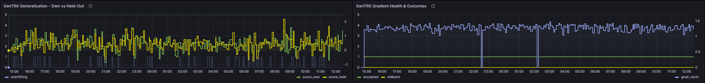

The Agent page also surfaces the selected miner's per-round GenTRX outcomes alongside the trading metrics.  The dedicated [GenTRX Page](#gentrx-page) covers the network-wide training state.

- **GenTRX Generalization - Own vs Held-Out** - For the selected agent, per-round own-data score and held-out validation score.  `score_own` is the gradient's improvement on the miner's own training data; `score_held` is its improvement on a held-out shard the miner never sees.  A persistent gap (own ≫ held) means the gradient is over-fitting; the `overfitting` series flags rounds where the validator detected this.

- **GenTRX Gradient Health & Outcomes** - For the selected agent, per-round gradient outcomes.  `accepted` flags rounds whose gradient cleared the score threshold and was applied this round; `rollback` flags rounds where this gradient was selected during a rollback; `grad_norm` is the L2 norm of the submitted gradient — useful for spotting collapsing or exploding gradients.

### Daily Volume Plot

This plot illustrates the average volumes over all selected validators which were traded by the selected agent over the last 24 simulation hours.  Volumes which the agent had traded in maker and taker role are illustrated as well as the total volume.  The agent's activity factor on average and for each book is also plotted; this is a function of the total traded volume and was applied to the unrealized Sharpe in obtaining the final unrealized score.  Although after release of version 0.2.0 the unrealized Sharpe is no longer used in obtaining miner scores, the total trading volume is important to monitor due to the trading volume cap indicated by the dashed red line - agents will be restricted from placing any new orders on books where the total trading volume exceeds this threshold.

### Round-Trip Volume Plot

This plot illustrates the average volumes over all selected validators which were round-tripped (either bought then sold or sold and then bought to open and close a position and thus realized a profit or loss) by the selected agent over the last 24 simulation hours.  The realized activity factor which is multiplied onto the realized Sharpe in obtaining the final realized Sharpe score for the agent is also plotted on average and for each book.

### Realized PnL Plot

This plot illustrates the realized PnL achieved by the agent in the most recent Sharpe assessment window over time.  Realized PnL is calculated from round tripped trades, using the price difference and fees/rebates to calculate the profit or loss realized through trading activity.

### Kappa3 Plots

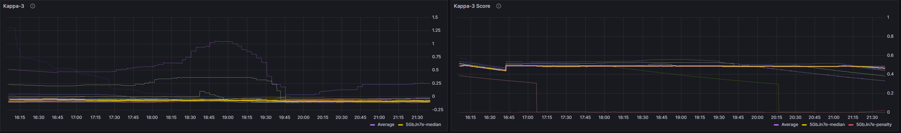

The Kappa3 plot displays the raw (unnormalized and unweighted) Kappa3 ratio achieved by the agent on all books, as well as the median value.
The Kappa3 Score plot displays the normalized and weighted Kappa3 Score calculated for the agent for each book, as well as the median value.  The outlier penalty applied to the score is also plotted.

### Unrealized Profit & Loss Plots

The Total Inventory Value Change plot illustrates the unrealized PnL (change in total inventory value) achieved by the agent since start of simulation or registration, for each book as well as in total.
The Unrealized PnL plot ilustrates the profit and loss (change in inventory value) achieved by the agent over the preceding Sharpe assessment window, for each book individually and in total.

### Last Fee Rate

This plot displays a history of the fee rates paid by the agent in their most recent trade on each book and on average across books.  The average and per-book MTR is also plotted.

### Balances Plots

The BASE and QUOTE balances and loans for the agent are plotted for each book as well as in total over all books.

## GenTRX Page

This page surfaces the state and health of the GenTRX distributed-training workload — the model-training side of incentive that runs alongside trading-simulation scoring.  Each round, validators score gradients submitted by miners, aggregate those that improve the held-out loss, and roll back if a round regresses.

### Status

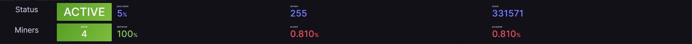

The top of the page summarises the current state of the training run.  The first row reports validator-side configuration and round counters; the second row tracks per-round miner participation through the pipeline.

- **GenTRX Status** - Whether GenTRX training is active.  Red = inactive; submitted gradients will not be scored.

- **Pool Share** - Fraction of validator scoring weight allocated to GenTRX.  Higher = a larger share of incentive comes from training.

- **Checkpoint Version** - Current model checkpoint version. Increments when a round is accepted.  Train against this version to avoid version-mismatch rejections.

- **Aggregation Round** - Current round number.  One round is one scoring + aggregation cycle.

### Miners

- **Active Miners** - Miners currently assigned a GenTRX gradient slot.

- **Delivered** - Fraction of assigned miners that fetched their assignment from the validator (`GET /gentrx/assignment`).  Low values point at miners not polling for work — this is the validator → miner direction, not the gradient submission.

- **Scored** - Fraction of assigned miners whose gradient reached the validator, parsed cleanly, and completed scoring without error.  Drops here mean upload, parse, or scoring failures — check gradient format and round version.

- **Accepted** - Fraction of assigned miners whose gradient cleared the score threshold and was applied to the model (`n_accepted / n_assigned`).  This is the end-to-end yield of the round; only this group earns reward this round.

### Training Progress

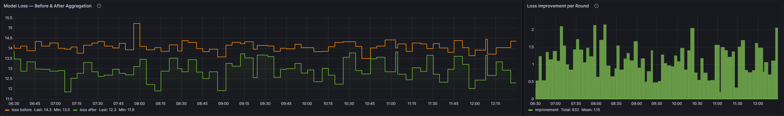

Two timeseries plots tracking model improvement and rollbacks across rounds.

- **Model Loss — Before & After Aggregation** - Held-out loss before (orange) and after (green) each round's accepted gradients.  The gap is per-round improvement.  When the lines converge, training is plateauing and higher-quality gradients are needed.

- **Loss Improvement per Round** - Per-round change in held-out loss.  Green bars = the round helped, red = rollback.

### Per-Miner Performance

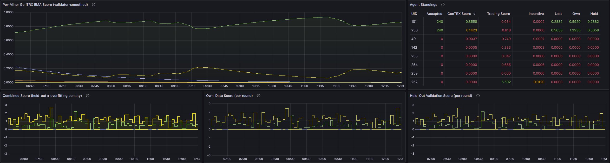

Per-miner scoring detail.  Series-line panels show the top 10 by current value; use the **Agent / UID** selector at the top of the page to focus on a specific miner.

- **Per-Miner GenTRX EMA Score** - EMA-smoothed GenTRX reward per miner.  This is the value the validator sets on-chain.  Range 0–1 after rank normalisation.

- **Agent Standings** - Per-agent table summarising GenTRX participation and reward over the current dashboard time window.
  - **Accepted** - Count of accepted rounds in the window.
  - **GenTRX** - EMA-smoothed GenTRX training score.

- **Combined Score (held-out ± overfitting penalty)** - Per-round combined score per miner.  Built from held-out loss improvement with a penalty applied when the gradient over-fit to the miner's own data.  This is what feeds the EMA reward.

- **Own-Data Score** - Per-round score on each miner's own training data.  Positive = the gradient improved the model on data the miner has seen.  Negative = the gradient did not even fit its own data.

- **Held-Out Validation Score** - Per-round score on a held-out shard the miner never sees.  The generalisation signal.  If held is much lower than own-data, the miner is over-fitting.

### Diagnostics

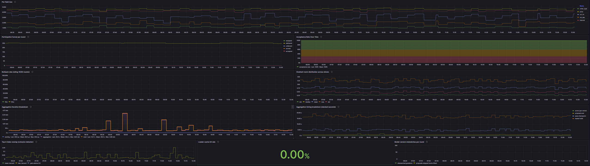

Lower-level diagnostics for troubleshooting training health and validator-side latency.

- **Per-field loss** - Cross-entropy loss per output field: order type, price, quantity (`vol_int`, `vol_dec`), time interval.  Persistently flat-high fields are underfit; gradients that move those fields are more valuable.

- **Participation funnel per round** - Round attrition through the pipeline.  `assigned` = chosen at round start; `delivered` = fetched their assignment; `collected` = gradient received and parsed by the validator; `scored` = scoring ran without error.

- **Acceptance Rate Over Time** - Acceptance rate (`n_accepted / n_scored`) over time.  Red zone (<30%): few of the gradients that reached scoring are clearing the threshold.  Green (>60%): healthy throughput.

- **Rollback rate (rolling 10/50 rounds)** - Rolling rollback rate over the last 10 and 50 rounds.  Persistent high values mean recent accepted gradients are not actually helping; reward density is lower in this regime.

- **Gradient-norm distribution across miners** - Distribution of miners' gradient L2 norms each round (min / median / mean / max / std).  Outliers in min or max often correlate with rejected gradients; aim for the median.

- **Aggregation Duration Breakdown** - Per-round validator latency: scoring (blue), aggregation + validation (purple), total (orange).  All in seconds.  Affects how quickly the next round opens.

- **Aggregation timing breakdown (stacked seconds)** - Stacked breakdown of where each round's time is spent on the validator (scoring, proposal eval, checkpoint save, loader build).  Does not affect scoring directly.

- **Top-k index overlap (collusion detector)** - Pairwise overlap between miners' top-k gradient indices.  High mean overlap can flag coordinated or copied gradients across miners.

- **Loader-cache hit rate** - Validator-side hit rate for the held-out data loader cache.  Affects round latency only; does not change scoring.

- **Model-version mismatches per round** - Submitted gradients each round that targeted a stale checkpoint version and were therefore discarded.  If non-zero, ensure you pull the latest checkpoint before each training round.