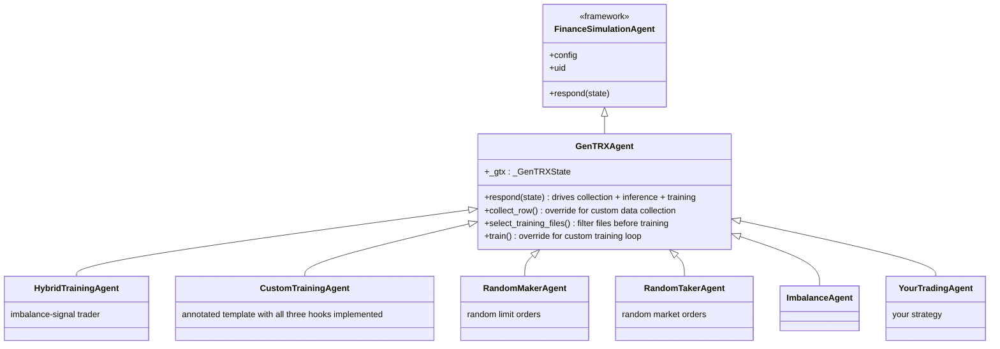
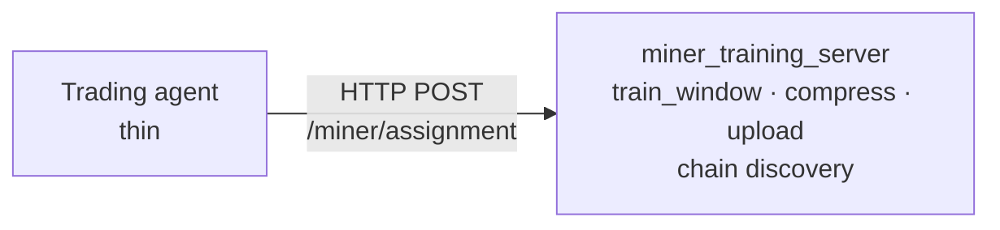
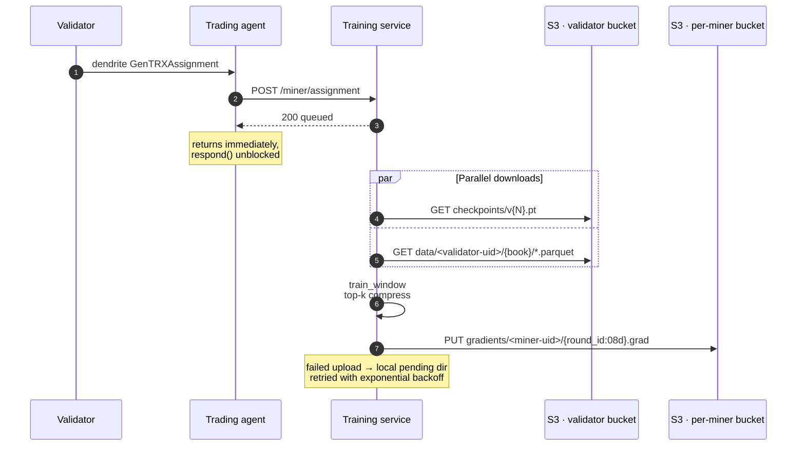

# GenTRX Integration

How a trading agent connects to GenTRX training. Three paths, in order of decoupling:

1. **Subclass `GenTRXAgent`.** Python inheritance, training runs in the same process as trading.
2. **HTTP API to `miner_training_server`.** Your trading agent stays independent and forwards assignment payloads over HTTP.
3. **`/gentrx/assignment` endpoint on the agent.** Testing and replay tool.

For when to pick which, see [`miner_setup.md` § Choosing your trading mode](miner_setup.md#choosing-your-trading-mode).

---

## Process model

### Inline (default)



One process on the miner host. The trading agent inherits from `GenTRXAgent`, which inherits from `FinanceSimulationAgent`. All state owned by `GenTRXAgent` lives under `self._gtx` so subclasses have one reserved attribute on `self` rather than the full set. The three responsibilities (`respond()`, inference, training thread) share the agent's process and CUDA device. The training thread runs in the background while `respond()` handles per-tick state; restarting the trading agent therefore restarts training too.

### Split



Two processes (same machine or separate hosts), HTTP between them. Lets the trading agent restart without disturbing in-flight training, and isolates inference from training on the GPU side.

---

## Path 1: subclass `GenTRXAgent`

Inheritance is the supported extension path for taos-framework agents. Subclass `GenTRXAgent`, add your strategy logic in `respond()`, and call `super()` at the right places. All example agents (`RandomMakerAgent`, `RandomTakerAgent`, `ImbalanceAgent`, `MovingHurstAgent`, `RevengAgent`, etc.) and `HybridTrainingAgent` follow this contract.

`GenTRXAgent` lives in the taos package:

```python
from taos.im.agents import GenTRXAgent
```

### Required calls

```python
from taos.im.agents import GenTRXAgent

class MyTradingAgent(GenTRXAgent):
    def initialize(self) -> None:
        super().initialize()        # MUST. Wires S3, training thread, /gentrx/assignment route.
        # ... your config reads ...

    def respond(self, state):
        response = super().respond(state)   # MUST. Runs collection, inference, training.
        # ... your trading logic, modify `response` and return it ...
        return response
```

Skipping either `super()` call removes that capability silently. No exception, no log, just dead code paths. Verify both lines exist.

### Reserved config keys

`--agent.params` keys starting with `gtx_` belong to `GenTRXAgent`. Subclasses must not consume them for strategy purposes; the parent reads them by name. The full mapping lives in [`miner_setup.md` § Configuration Parameters](miner_setup.md#configuration-parameters).

Strategy keys are owned by the subclass and stay unprefixed. The existing subclasses use `imbalance_depth`, `min_quantity`, `expiry_period`, `entry_threshold`, etc.

### Reserved attribute names

`GenTRXAgent` keeps all of its state under a single attribute on `self`:

- **`self._gtx`** is owned by the parent. Do not reassign or read into it from a subclass; the namespace covers per-book state, model + tokenizer, training queue and thread, S3 wiring, the training logger, and every `gtx_*` config value the agent consumes.

That is the entire contract. Any other attribute name on `self` is either inherited from the framework (`config`, `uid`, `router`, `metagraph`, `subtensor`, `simulation_config`, etc.) or fair game for the subclass.

### What you can safely override

- `respond()`: call `super().respond(state)` first, then modify the returned `FinanceAgentResponse`.
- `collect_row()`: custom data collection - see below.
- `select_training_files()`: filter which parquets feed the training window - see below.
- `train()`: custom training loop - see below.
- `update()` and `report()`: strategy bookkeeping. The parent does not implement these.
- Any helper named under your subclass's own naming convention.

Overriding `_maybe_train`, `_train_background`, or any other underscore-prefixed method on `GenTRXAgent` is unsupported. Those are internal and can change without a deprecation cycle.

### Training and data-collection hooks

`GenTRXAgent` exposes three public override points for customising the training pipeline. All three are fully implemented in `agents/CustomTrainingAgent.py`, which is the recommended starting point - the file copies the default logic for each method so you can read, modify, and experiment without tracing into the base class.

#### `collect_row()` - custom data collection

Called once per order or cancellation event when `gtx_collect_data=true`. Returns the row dict to buffer (or `None` to drop the event). The base-class default records every event with the standard schema. Override to:

- Filter events by book (`return None if book_id not in {12, 45}`)
- Drop cancels (`return None if order_type == CANCEL`)
- Change how prices or volumes are normalised
- Add extra columns (they are preserved in parquet for offline use but ignored by the model's `OrderDataset`)

```python
from GenTRX.src.orderbook import BID, ASK, CANCEL, LOB_DEPTH, LobSnapshot

def collect_row(
    self,
    book_id: int,
    ts: int,
    order_type: int,
    price_ticks: int,
    qty: float,
    snap: LobSnapshot,
    session_open_mid: int | None,
    *,
    interval_ns: int = 0,
) -> dict | None:
    if order_type == CANCEL:
        return None  # drop cancels from local parquet
    # ... build and return the row dict
    return super().collect_row(
        book_id, ts, order_type, price_ticks, qty, snap,
        session_open_mid, interval_ns=interval_ns
    )
```

The returned dict must be compatible with `order_stream_schema()` (`GenTRX/src/util/schema.py`). Missing required columns raise at flush time; extra columns are silently ignored by the writer.

#### `select_training_files()` - filter files before training

Called at the start of each training window, before the `DataLoader` is built. `parquet_files` is every local file downloaded for the round; `assignment` is the primary assignment dict (keys: `round`, `books`, `ts_start`, `ts_end`, `validator_uid`, …). Return an empty list to skip the window.

```python
def select_training_files(
    self, parquet_files: list[Path], assignment: dict | None
) -> list[Path]:
    # Train only on the books the validator assigned us
    books = set(str(b) for b in (assignment or {}).get("books", []))
    return [f for f in parquet_files if f.parent.parent.name in books]
```

#### `train()` - custom training loop

The top-level training entry point, called on a background thread after model and data have been downloaded. The foreground `respond()` path is unblocked as soon as training starts.

`train_model` is a deep copy of `self._gtx.model` - mutate it freely. The method must compress and upload the resulting delta; only the compress/serialize/upload block must remain unchanged (the validator scores the gradient bytes, not the model weights).

```python
from GenTRX.src.distributed import train_window, WindowConfig
from GenTRX.src.gradient import compress, serialize

def train(
    self,
    parquet_files: list[Path],
    train_model,
    assignment: dict | None = None,
) -> None:
    parquet_files = self.select_training_files(parquet_files, assignment)
    if not parquet_files:
        return

    # ... build DataLoader from parquet_files ...

    win_cfg = WindowConfig(
        n_steps=self._gtx.train_steps * 2,  # train longer
        lr=self._gtx.train_lr * 0.5,
        window_id=self._gtx.train_window_id,
        miner_uid=self.uid,
    )
    delta = train_window(train_model, loader, win_cfg, self._gtx.device)
    comp  = compress(delta, top_k_frac=self._gtx.top_k_frac)
    data  = serialize(comp)

    round_id = (assignment or {}).get("round", self._gtx.train_window_id)
    self._gtx.write_store.put_gradient(
        miner_uid=self.uid, round_id=round_id, data=data
    )
```

See `agents/CustomTrainingAgent.py` for the full implementation including the upload, pruning, and pending-retry logic that should be kept when overriding `train()`.

---

---

## Path 2: HTTP API to `miner_training_server`

For operators whose trading agent is not a Python subclass of `GenTRXAgent`, or who want trading restarts to leave in-flight training untouched. Run the standalone training server and forward each dendrite assignment to it as JSON. Authentication is a shared API key in the `X-API-Key` header.

All endpoints accept / return JSON. When `--api-key` is set, every request must carry `X-API-Key`.

### Running the service

Same-machine deployment (loopback, no API key needed):

```bash
venv/<your-env>/bin/python -m GenTRX.src.miner_training_server \
    --uid <your-uid> --port 8200 --bind 127.0.0.1 \
    --gtx-train-steps 50 --gtx-train-batch-size 8 --gtx-train-seq-len 256 \
    --gtx-aggregator-uid 0 \
    --subtensor-network finney --netuid 79
```

`GENTRX_AGENT_S3_*` env vars must be set on the host running the service; this is the process that uploads gradients. The trading agent appends `gtx_training_url=http://127.0.0.1:8200` to its `--agent.params` to start forwarding.

Cross-machine deployment: bind `0.0.0.0`, set `GENTRX_MINER_API_KEY` on both hosts (the service reads it via the `--api-key` env fallback), and set `gtx_training_api_key` on the trading agent alongside `gtx_training_url`.

#### Cross-machine connectivity

`--api-key` authenticates the request but the header travels in plain text. On any non-loopback path, encrypt the channel. Three options from simplest to most involved (the validator-side has the same options at [`operations.md` § TLS termination](operations.md#tls-termination)):

**Option 1: Cloudflare Tunnel (cloudflared), recommended.** No port forwarding, no certificate management, works behind NAT. The tunnel runs on the GPU host and exposes the service at a stable URL the trading host points at via `gtx_training_url`.

```bash
# On the GPU host, install once
curl -L https://github.com/cloudflare/cloudflared/releases/latest/download/cloudflared-linux-amd64.deb \
    -o cloudflared.deb && sudo dpkg -i cloudflared.deb

# Keep the service bound to loopback; expose it through the tunnel
cloudflared tunnel --url http://127.0.0.1:8200
# → prints https://<random-words>.trycloudflare.com
```

On the trading host, set `gtx_training_url` to that printed URL plus `gtx_training_api_key` to the shared secret. Keep the API key. The tunnel encrypts the channel, the key authenticates the caller; both are needed.

For a stable domain (production): `cloudflared tunnel login`, create a named tunnel, point a DNS CNAME on your Cloudflare zone at it, run `cloudflared tunnel run <tunnel-name>` under pm2 alongside the service.

**Option 2: ngrok, fast prototyping.** Same shape as cloudflared but without a Cloudflare account (free tier rotates the URL on every restart, so don't use it for a long-running production miner).

```bash
# On the GPU host
curl -sSL https://ngrok-agent.s3.amazonaws.com/ngrok.asc \
    | sudo tee /etc/apt/trusted.gpg.d/ngrok.asc >/dev/null \
  && echo "deb https://ngrok-agent.s3.amazonaws.com buster main" \
    | sudo tee /etc/apt/sources.list.d/ngrok.list \
  && sudo apt update && sudo apt install ngrok

ngrok config add-authtoken <your-token>
ngrok http 127.0.0.1:8200
# → forwarding https://<subdomain>.ngrok-free.app → http://127.0.0.1:8200
```

Set `gtx_training_url` to the printed `https://...ngrok-free.app` URL on the trading host. Keep `gtx_training_api_key` set. ngrok gives encryption, not authentication. ngrok's paid tier offers reserved domains if you want a stable URL.

**Option 3: Private network (Tailscale, WireGuard, VPC).** If both hosts share an encrypted private network already, bind the service to the private IP (`--bind <private-ip>`) and use that IP directly in `gtx_training_url`. No tunnel needed; keep `gtx_training_api_key` for defence-in-depth.

### Operator responsibilities

Ownership splits between the two processes.

**Training-service host (`miner_training_server`):**

- The per-miner R2 / Hippius bucket (`miner_setup.md` Step 1).
- The on-chain bucket commit (`miner_setup.md` Step 2).
- The `GENTRX_AGENT_S3_*` env vars (`miner_setup.md` Step 3); this is the process that uploads gradients.
- Pulling checkpoints from the aggregator bucket via chain-based discovery.

**Trading-agent host:**

- Bittensor wiring: hotkey registration, axon, dendrite reception of `GenTRXAssignment`, axon serving on the chain.
- Forward reliability. If the agent crashes between dendrite receipt and the HTTP POST, that round's gradient is silently missed. Treat the forward as part of the agent's `respond()` failure path with a retry or pending queue.

### POST `/miner/assignment`

Forwarded by the trading agent immediately on dendrite arrival. Body is the assignment payload as-is (same schema as in [`data_flow.md`](data_flow.md#assignment-json--served-via-http)):

```json
{
  "round": 42,
  "model_version": 5,
  "books": ["12", "45", "78"],
  "ts_start": 1800000000000,
  "ts_end": 2100000000000,
  "data": ["data/12/intervals/00003000-00004000.parquet", "..."],
  "data_source": "s3",
  "data_endpoint": "https://...",
  "data_bucket": "...",
  "data_access_key": "...",
  "data_secret_key": "...",
  "validator_uid": 0
}
```

Response: `{"status": "queued", "round": 42}`. The service appends the assignment to its pending queue and returns immediately; the agent must not block on training. Multiple validators can post assignments for the same round; the service merges them on dequeue. Submitting the same `round` twice is idempotent.

**Round timing.** Rounds advance on the chain block counter. The validator closes each round by calling `POST /gentrx/round` on the gradient server (configured by the validator's `--gentrx.blocks_per_round`). Miners work on an assignment until the next assignment arrives. The gradient server keeps a server-side heartbeat-loss fallback (`--blocks-per-round` × `--block-time-s` + `--round-grace-s`) that force-closes the round if the validator stops pushing closures, so scoring does not stall. On a checkpoint roll the fallback estimate is bumped to give miners time to download the new model.

### GET `/miner/status`

```json
{
  "uid": 7,
  "training_in_progress": true,
  "pending_assignments": 1,
  "model_version": 5,
  "last_uploaded_round": 41,
  "last_loss_before": 13.77,
  "last_loss_after": 10.24,
  "train_window_id": 41,
  "retry_cooldown_s": 30,
  "pending_retry_count": 0
}
```

For dashboards, supervisors, and external probes. Cheap, no S3 calls.

### GET `/miner/version`

Liveness + identity probe. Mirror of `gradient_server`'s `/gentrx/version`.

```json
{"version": "0.1.0", "uid": 7, "model_version": 5}
```

### What the service does NOT expose

- **No checkpoint serving.** Checkpoints live on the aggregator bucket; the service pulls from chain-discovered S3, never re-publishes. (Pulling from a co-located service would centralise a per-miner failure point.)
- **No gradient inspection.** Gradients are write-only from the service to the per-miner S3 bucket. Whoever wants to inspect them reads S3 directly.
- **No remote control over training params.** `gtx_train_steps` etc. are CLI args of the service process, not request parameters. A request cannot tell the service to train for 10x longer than configured.

### Round lifecycle in split mode



The agent's responsibility ends at step 3 (`200 queued`). All round tracking, S3 retries, and model-version juggling are the service's problem.

### Failure modes

| Failure | Behaviour | Operator action |
|---|---|---|
| Service down at assignment time | Agent logs WARN, drops the assignment for this round (zero score), keeps trading | Restart service; next round resumes |
| Service slow / busy training previous round | Agent's POST returns immediately; service queues if not in-flight, otherwise drops with `{"status": "busy"}` | Tune `gtx_train_steps` / batch size |
| Agent restart | Training thread keeps running on the service host. New agent process resumes posting assignments on next round | None; split topology already isolates this |
| Service restart mid-training | In-progress gradient lost; pending dir on disk preserves any uploaded-but-unacked gradients | None; server resumes retry loop on startup |
| API key mismatch | Service returns 401, agent logs ERROR loudly | Sync `GENTRX_MINER_API_KEY` on both hosts |
| Service can't reach S3 | Gradient saved to local pending dir, retried on cooldown (30 s → 300 s); status endpoint reports `pending_retry_count > 0` | Inspect S3 creds; pending dir replays automatically once reachable |
| Trading agent forwards same assignment twice | Service deduplicates by `(validator_uid, round)` on the queue side | None |

The agent never blocks on the service. If the service is unreachable, the round simply goes unscored and trading continues. This is a deliberate weakening of training availability in exchange for trading availability: the trading score carries the larger weight, and a degraded training service must not take down the miner's kappa.

---

## Path 3: `/gentrx/assignment` on the trading agent

The trading-agent process binds a FastAPI router on its `--agent.port`. Two endpoints are public:

| Endpoint | Method | Purpose |
|---|---|---|
| `/handle` | POST | Per-tick state update from the miner neuron (internal) |
| `/gentrx/assignment` | POST | Drop-in for assignment delivery; accepts the same JSON payload as the dendrite |

The agent does NOT authenticate either endpoint by default. Bind to a private interface or run a reverse proxy if you expose them.

`/gentrx/assignment` accepts the assignment JSON described in [`data_flow.md`](data_flow.md#assignment-json--served-via-http). Use it to:

- Test the training path locally without a validator.
- Drive training from a local orchestrator (e.g. cron-style replay of recorded assignments).
- Trigger ad-hoc training during the bootstrap window before any validator has dendrited an assignment.

In production the dendrite path is the actual delivery channel: `taos/im/neurons/miner.py` → `forward_gentrx_assignment` writes straight to `self.agent._pending_assignments` (no HTTP), so split-mode forwarding fires from the agent's `respond()` drain, not from this HTTP route.
